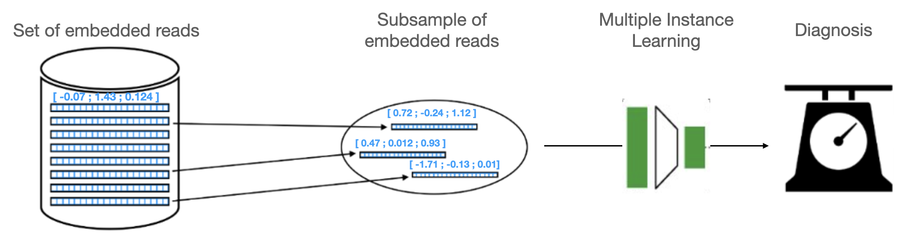
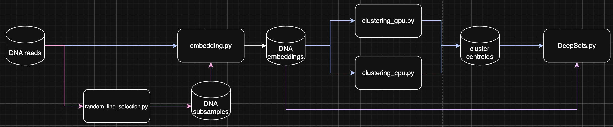

# MetagenBERT-MIL README

## Introduction

MetagenBERT-MIL is a Transformer-based tool for disease prediction from metagenomic data. It is separated between two different yet similar tools : MetagenBERT-Local and MetagenBERT-Sub. These models can be trained to directly classify metagenomic samples from raw shotgun sequencing reads, without relying on reference databases or intermediary steps such as assembly or taxonomic classification. This method is adapted to short reads samples.
MetagenBERT-MIL works by relying on Transformer models such as DNABERT-2 [1] to produce embeddings of DNA reads. The model works either by selecting centroids obtained after clustering of these embeddings of reads, or by simply selecting random read embeddings. A DeepSets [2] model is then trained for classification.

## Pipeline

The metagenome classification is obtained through different steps : 
First, the reads from each samples are embedded by a genomic LLM (originally DNABERT-2 or DNABERT-MS). This step is particularly expensive in computation time and shall be executed using GPUs. To mitigate the cost, MetagenBERT-Sub uses only a few reads (called subsamples) and embeds only these ones. MetagenBERT-Local uses centroids obtained after clustering the read embeddings. A rule of thumb is that using only number of clusters * 1000 elements is enough for stable clustering, thus further mitigating the cost. The embedding step can be performed with embedding.py script.
When using MetagenBERT-Sub, we propose randomly selecting reads for each samples before embedding by unsig random_line_selection.py script. These embeddings can then be directly used for classification with the DeepSets classification algorithm.
On the other hand, when using MetagenBERT-Local, a clustering algorithm such as K-Means is used on DNA read embeddings. The centroids of the clusters are retrieved and will be used as representation of the sample. K-Means must run for each sample independantly and can be run either on CPU via faiss_clustering_cpu.py script or on GPU via faiss_clustering_gpu.py.
As a final step, a DeepSets model can be trained on the representations obtained : either subsamples embeddings or centroids. 
The theoric pipeline and the computing pipeline can be seen in the figures above.

*MetagenBERT-Local: The Clustering Architecture. For each metagenome, reads are embedded through the use of a gLLM. For each genome, a subsample of embeddings is used to train a K-means. The centroids of the clusters obtained through K-means are retrieved and used to train a Multiple-Instance Learning DeepSets model to classify tthe dataset.*

*MetagenBERT-Sub: The Subsampling Architecture. For each metagenome, random reads are selected and embedded through the use of a gLLM. These embeddings are directly used to train a Multiple-Instance Learning DeepSets model to classify the dataset.*

*Script usage pipeline. The blue path corresponds to the flowchart of MetagenBERT-Local, while the pink path corresponds to the flowchart of MetagenBERT-Sub.*

## Dependencies

The following packages are required to use MetagenBERT : 
torch
numpy
pandas
scikit-learn
xgboost
faiss-gpu (or faiss-cpu)
transformers

## Script Usage

In this section, we describe each script, its usage, inputs and outputs

### random_line_selection.py

This script takes a directory of fasta files contining only DNA sequences. For example, the 5 first lines of a sample should look like this : 

AGCTAGCTGCTAGATCGATCGATCGATCGATCGTCGATTCGGCTCGATCGGTAGCTAGTAACCCGATCGATGATGAT
GTGCTAGCTTACCGTTTTATTCGCGTATAAAGCATGAGAGATCCTACGATGCCTTTAGCATCACGTACTATATCGAT
GCTTCGTAATGCGCGGCCCGCCATATCGATGCATGCATATAATCTGCACGATCCTCCTGCTCATATATCTACTTCGC
CTAACGTTACGATCCCATCGATGATGCTGGTCGTCGCTGCAATCGACTGCTAGCATGATCTGCAGCTACGAGCTATC
CGTCGTCGCGTGCGTCAACGAAAAAAAAAACGAGCTAGCTAGCTCGATCCGCTACTACGCTGAATAATCGGCCTGAA

It then selects randomly some sequences in the file that can later be used for MetagenBERT-Sub.
usage : 
`python random_line_selection.py input_dir output_dir num_lines --seed`

- input_dir : the path to a dir of fasta files as described before

- output_dir : the directory to save the new files

- num_lines : the number of lines to select in each file

- --seed : seeding the draw for reproducibility

### embedding.py

This script uses a LLM to produce embeddings of all the reads of all samples in a directory and saves them by batch.

usage : 
`python embedding.py model_path sequence_dir max_length saving_path batch_size world_size`

- model path : the path to the transformer model used to produce the embeddings. Can be a local link or a link to a HuggingFace repository. The authors used DNABERT-2 and provide the local version in this repository (some minor corrections were applied, like disabling FlashAttention for compatibility issues)

- sequence_dir : the path to a directory containing the txt files to embed. The authors strongly advise that one file should correspond to one metagenomic sample. we remind the user that the results show almost none to none performance loss when using only 5-10% of reads per samples, and advise them to directly use files containing only this proportion of reads from the original samples. For computational efficiency, the files should contain only DNA sequences, and look like they are described in random_line_selection.py

- max_length : the length to which each sequence will be truncated or padded before entering the Transformer model. This can depend on the length of the reads to embed and on the tokenizer of the model

- saving_path : the path to the directory where the results will be stored. In this directory, the script will create two new directories named "embeddings" and "idx". In each of these two directories, one directory per sample will be created, in which the outputs will effectively be stored.
Considering the sample named S1, in /saving_path/embeddings/S1/ , the program will save one embedding file per batch under the name embeddings_X_Y.pt with X the rank of the batch and Y the rank of the GPU. Therefore, if S1 contains 100.000 reads and is embedded on 4 GPUs with a batch size of 10.000, the directory will contain 12 files named embeddings_{0,1,2}_{0,1,2,3}.pt, with embeddings_{0,1}_{0,1,2,3}.pt containins 10.000 embeddings each and embeddings_{2}_{0,1,2,3}.pt containing 5.000 embeddings each, totalling 100.000.
The "idx" directory follows the same structure, with files named "idx_X_Y.pt". These files simply keep track of the line number in the original sample file corresponding to each embedding, allowing the user to associate each embedding to the sequence it originates from.

- batch_size : the number of sequences treated at once by each GPU. From our experience, using DNABERT-2, A100 GPUs could be used with a batch size of 35.000 - 40.000 sequences

- world_size : the number of processes (and therefore GPUs) the program will have access to. This script was only tested on a single node. The authors adapted a version usable on French supercalculator Jean-Zay [3] in a multi-node configuration. This requires the use of the package idr_torch and is not adapted to most configurations. This script can be asked to the authors.

### clustering_gpu.py

This script uses a dataset of embedding directories as obtained from the usage of embedding.py and loads a given number of reads from each sample. It then uses FAISS [4] package to perform K-Means clustering with GPU acceleration.

usage:
`python clustering_gpu.py data_path save_path n_clusters n_iter min_points max_points`

- data_path : the path to the directory of saved embeddings as obtained through embedding.py. This directory shall contain one subdirectory per sample the user wishes to cluster. Each subdirectory shall contain the embeddings_X_Y.pt files obtained before. The authors advise the user not to merge the files obtained before, as the resulting file would probably be very heavy and could lead to issues in RAM. No other file than the embeddings_X_Y.pt files should be in these directories

- n_clusters : the number of clusters and therefore centroids that will represent each sample

- save_path : the path to the directory where both centroids and faiss index will be saved. Only the centroids file will be used by the DeepSets model

- n_iter : number of iterations for the K-means algorithm 

- min_points : minimum number of points to use for clustering. This number will be multiplied by the number of clusters. The authors recommand to set it low

- max_points : maximum number of points to use for clustering. This number will be multiplied by the number of clusters. The authors recommand to set it high enough so that max_points*number_of_clusters > n_to_load*number_of_files

### clustering_cpu.py

This script has the same usage and function as faiss_clustering-gpu.py but does not support gpu acceleration. Be careful to have installed the faiss implementation corresponding to your resources.

### DeepSets.py

This script trains a DeepSets model using either subsamples embeddings (MetagenBERT-Sub) or centroids obtained after clustering (MetagenBERT-Local)

usage :
`python DeepSets.py samples_dir corresp epochs batch_size splits patience min_delta eval_every Phi_hidden_init Phi_n_layer Phi_dropout Rho_hidden_init Rho_n_layer Rho_dropout`

- samples_dir : path to the directory of the dataset. This directory should contain one directory per sample that each contain either the output of embedding.py (several embeddings_X_Y.py files) or the output of clustering (one centroids.npy file).

- corresp : path to the labels file. File should be json containing one dictionary where keys are sample ids (identical to the names of directories in the dataset of samples_dir) and values are int labels

- epochs : number of epochs to train the model

- batch_size : batch size for training

- splits : number of splits for cross validation

- patience : number of epochs without amelioration of eval AUC before early stopping

- min_delta : minimum amelioration required to reset patience

- eval_every : number of epochs before evaluation run

- Phi_hidden_init : initial hidden dimension of Phi network

- Phi_n_layer : number of intermediate layers of Phi network

- Phi_dropout : dropout applied in Phi

- Rho_hidden_init : initial hidden dimension of Rho network

- Rho_n_layer : number of intermediate layers of Rho network

- Rho_dropout : dropout applied in Rho

- mil_layer : type of layer used for MIL, can be "mean", "sum", "max" or "attention"

[1] Zhihan Zhou, Yanrong Ji, Weijian Li, Pratik Dutta, Ramana V Davuluri, and Han Liu. DNABERT-2: Efficient foundation model and benchmark for multi-species genomes. The Twelfth International Conference on Learning Representations, 2024.

[2] Manzil Zaheer, Satwik Kottur, Siamak Ravanbhakhsh, Barnabás Póczos, Ruslan Salakhutdinov, and Alexander J Smola. 2017. Deep Sets. In Proceedings of the 31st International Conference on Neural Information Processing Systems (NIPS'17). Curran Associates Inc., Red Hook, NY, USA, 3394–3404.

[3] http://www.idris.fr/jean-zay/jean-zay-presentation.html

[4] Matthijs Douze, Alexandr Guzhva, Chengqi Deng, Jeff Johnson, Gergely Szilvasy, Pierre-Emmanuel Mazaré, Maria Lomeli, Lucas Hosseini, Hervé Jégou. The Faiss library. arXiv. 2024.
